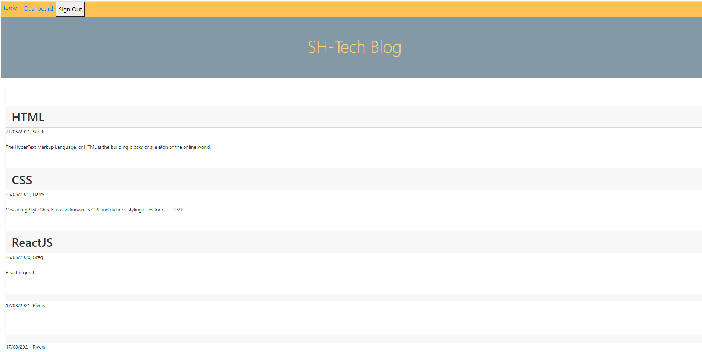
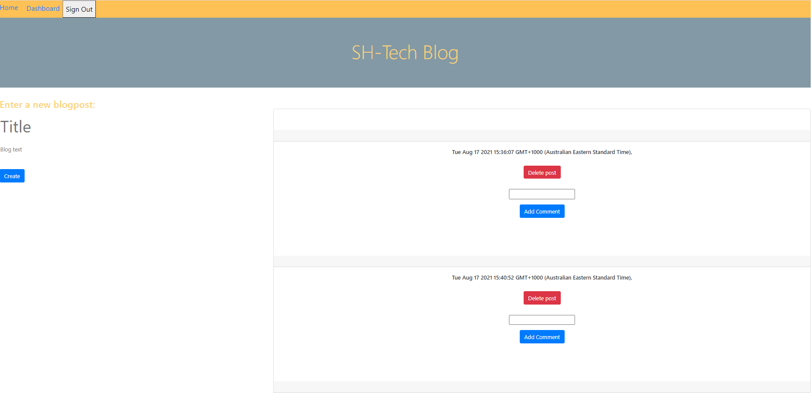

# SH-Tech-Blog

  

  ## Table of Contents
   
   [ - Description](#description)
 
   [ - Installation](#installation)
 
   [ - Usage](#usage)
   
   [ - Contributing](#contributing)
   
   [ - Tests](#tests)
   
   [ - Questions](#questions)
  
   [ - License](#license)

 
   ## Description
  This blog is a collaborative platform enabling users to create a username then log in to create, read, update and delete blog posts about anything tech. The user is also able to comment on other user's posts from their dashboard. Secure access to the contributer dashboard is provided with express-sessions and bcrypt.
  [Deployed at Heroku](https://pure-temple-76115.herokuapp.com/)

  ## Screenshots
  

  
  

  
  ## Installation
 Run command "npm i" in the integrated terminal.
 

  ## Usage
 The purpose of this tech blog is to create a spc to interact with other developers and share tech ideas.
 
  
  ## Contributing
  N/A
 
  
  ## Tests
  N/A
  

  ## Questions
  Feel free to contact me via email, smcfarland2@gmail.com if you have any questions regarding this project. 
  Additionally, my GitHub profile is [SarahHn92](https://github.com/SarahHn92) to view more projects.

  ## License
  There is no licensing information for this project.s